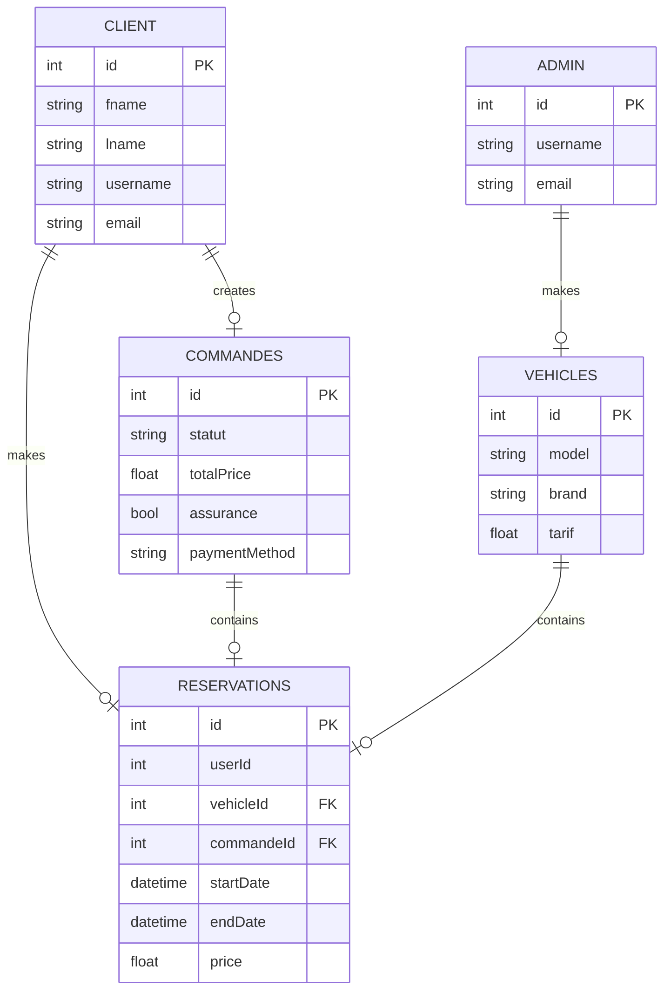

```mermaid
erDiagram
    COMMANDES {
        int id PK
        string statut
        float totalPrice
        bool assurance
        string paymentMethod
    }

    RESERVATIONS {
        int id PK
        int userId
        int vehicleId FK
        int commandeId FK
        datetime startDate
        datetime endDate
        float price
    }

    VEHICLES {
        int id PK
        string model
        string brand
        float tarif
    }

    CLIENT {
        int id PK
        string fname
        string lname
        string username
        string email
    }

    ADMIN {
        int id PK
        string username
        string email
    }

    COMMANDES ||--o| RESERVATIONS : contains
    VEHICLES ||--o| RESERVATIONS : contains
    CLIENT ||--o| RESERVATIONS : makes
    ADMIN ||--o| VEHICLES : makes
    CLIENT ||--o| COMMANDES : creates
```